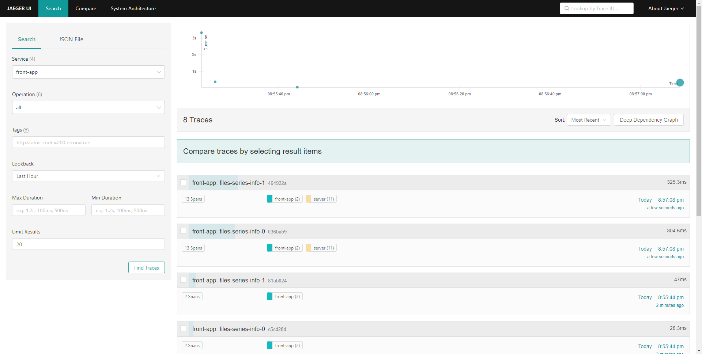

## 安装 Jaeger

All in One

拉取镜像

```shell
docker pull jaegertracing/all-in-one:1.34
```

运行镜像服务

```shell
docker run -d --name jaeger \
  -e COLLECTOR_ZIPKIN_HOST_PORT=:9411 \
  -p 5775:5775/udp \
  -p 6831:6831/udp \
  -p 6832:6832/udp \
  -p 5778:5778 \
  -p 16686:16686 \
  -p 14250:14250 \
  -p 14268:14268 \
  -p 14269:14269 \
  -p 9411:9411 \
  jaegertracing/all-in-one:1.34
```

通过 `http://localhost:16686` 来访问 Jaeger UI.

容器对应端口信息如下：

| Port  | Protocol | Component | Function                                                                                      |
| ----- | -------- | --------- | --------------------------------------------------------------------------------------------- |
| 5775  | UDP      | agent     | accept `zipkin.thrift` over compact thrift protocol (deprecated, used by legacy clients only) |
| 6831  | UDP      | agent     | accept `jaeger.thrift` over compact thrift protocol                                           |
| 6832  | UDP      | agent     | accept `jaeger.thrift` over binary thrift protocol                                            |
| 5778  | HTTP     | agent     | serve configs                                                                                 |
| 16686 | HTTP     | query     | serve frontend                                                                                |
| 14268 | HTTP     | collector | accept `jaeger.thrift` directly from clients                                                  |
| 14250 | HTTP     | collector | accept `model.proto`                                                                          |
| 9411  | HTTP     | collector | Zipkin compatible endpoint (optional)                                                         |

如果不想让jaeger收集zipkin数据，可以去掉 zipkin

```shell
docker run -d --name jaeger \
  -p 5775:5775/udp \
  -p 6831:6831/udp \
  -p 6832:6832/udp \
  -p 5778:5778 \
  -p 16686:16686 \
  -p 14250:14250 \
  -p 14268:14268 \
  -p 14269:14269 \
  jaegertracing/all-in-one:1.34
```

## jaeger-ui

### 首页



### 火焰图


## 了解更多

开始玩转 jaeger  https://www.jaegertracing.io/docs/1.34/getting-started/
