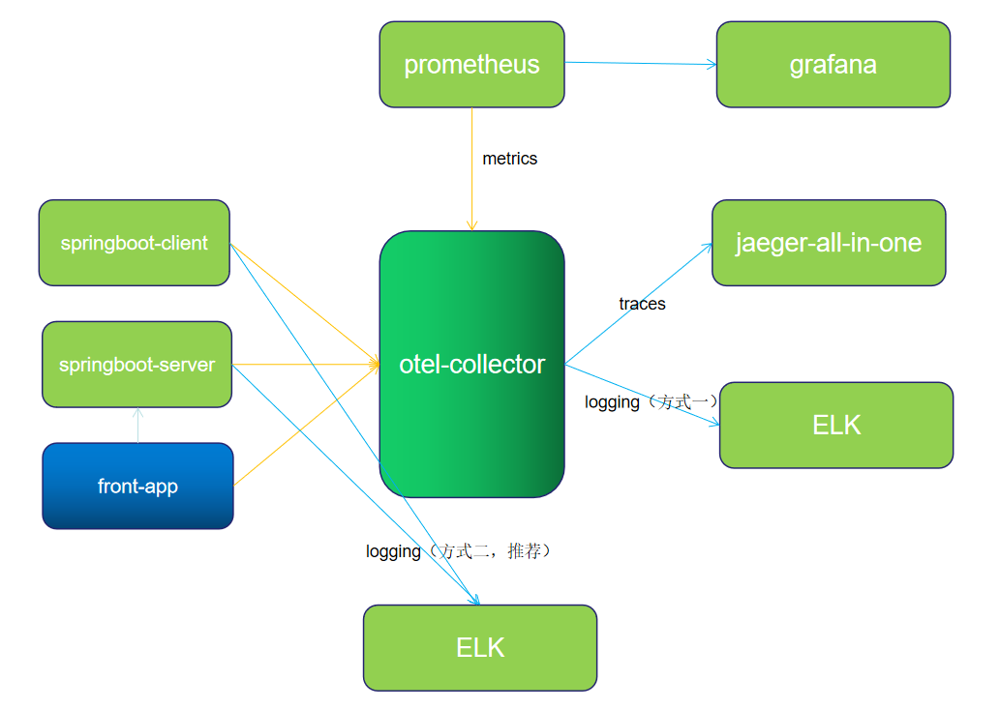
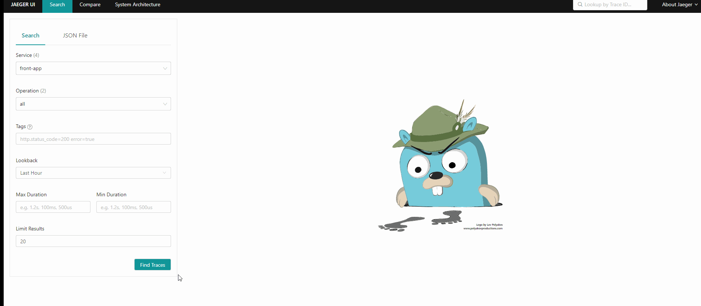
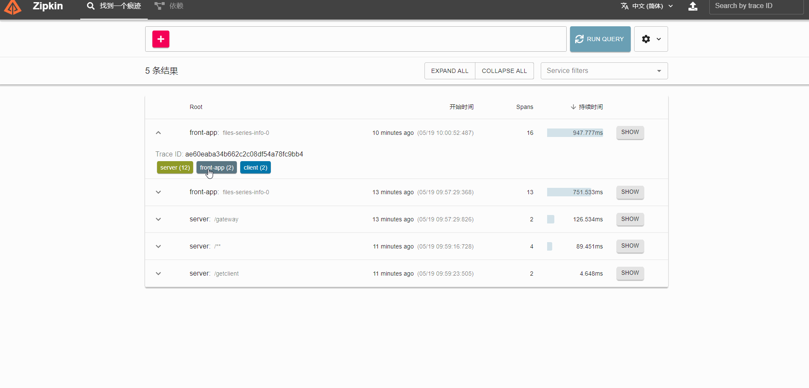

# 当前demo为 Opentelemetry to Jeager、Zipkin 、Prometheus、Grafana、ELK

opentelemetry-collector 版本为 0.50.0

```
image: otel/opentelemetry-collector-contrib:0.51.0
```

## 服务列表

| 服务名称           | 端口        | 描述                       | 请求地址            |
| -------------- | --------- | ------------------------ | --------------- |
| jaeger         |           | 端口查看 docker-compose.yml  | http://ip:16686 |
| zipkin         | 9411:9411 | openzipkin/zipkin:latest | http://ip:9411  |
| otel-collector |           | 端口查看 docker-compose.yml  |                 |
| prometheus     | 9090:9090 | prom/prometheus:latest   | http://ip:9090  |
| grafana        | 3000      |                          | http://ip:3000  |
| elasticsearch  | 9200      |                          | http://ip:9200  |
| kibana         | 5601      |                          | http://ip:5601  |

ELK相关部署参考ELK部分 https://github.com/lrwh/observable-demo/tree/main/opentelemetry-collector-to-all/elk

## 架构



### 架构说明

1、应用 server 和 client 将 metric 、trace 数据通过 otlp-exporter push 到 otel-collector

2、front-app 为前端链路，将链路信息 push 到 otel-collector，并访问应用服务 API

3、otel-collector 对数据进行收集、转换后，将数据 push 到 Jaeger、Zipkin

4、同时 Prometheus 从 otel-collector pull 数据。

日志两种推送方式：

方式一：通过 OTLP 上报日志

应用 server 和 client 将 log 通过 otlp-exporter push 到 otel-collector，再通过 otel-collector exporter 到 Elasticsearch。<font color="red">由于 Opentelemetry log 方面还不稳定，所以推荐 log 单独处理，不走 otel-collector，在测试过程中也发下了 同时配置 log 和 metric 存在冲突问题，主要表现在 otel-collector 上，等待官方修复吧。</font>

方式二：通过 Logback-logstash 上报日志

应用 server 和client将 log 通过 Logback-logstash 推送到 logstash。

### Exporter
otel-collector 配置了四个 exporter.

```yaml
  prometheus:
    endpoint: "0.0.0.0:8889"
    const_labels:
      label1: value1
  zipkin:
    endpoint: "http://otel_collector_zipkin:9411/api/v2/spans"
    format: proto
  jaeger:
    endpoint: otel_collector_jaeger:14250
    tls:
      insecure: true
  elasticsearch:
    endpoints: "http://192.168.0.17:9200"
```

> 注意，所有的应用都部署在同一个机器上，机器 ip 为 192.168.0.17。如果应用和一些中间件单独分开部署，则注意修改对应的 IP。如果是云服务器，则注意开放相关端口，以免访问失败。

## 部署

1. 执行docker-compose up -d

2. 检查应用运行情况 docker-compose ps 

3、启动 server （https://github.com/lrwh/observable-demo/blob/main/springboot-server ）、client(可选 https://github.com/lrwh/observable-demo/blob/main/springboot-client )、front-app( https://github.com/lrwh/observable-demo/tree/main/opentelemetry-js )

4、访问 http://front-app-host:front-app-port/xml-http-request，产生 trace 信息并调用接口。

5、查看各个观测平台UI

## jaeger-ui



## zipkin-ui


