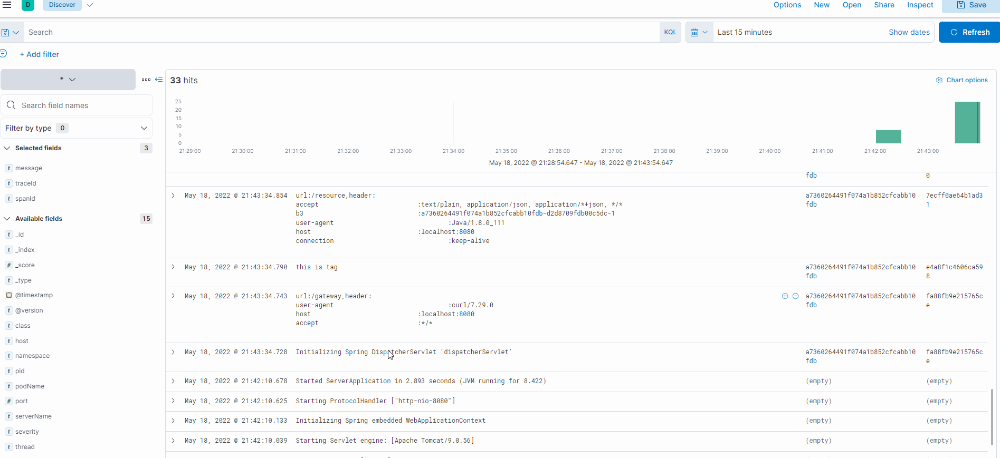
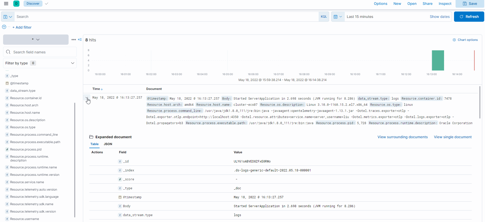

## Docker 安装 ELK

采用 Docker 安装 ELK ,简单又方便，相关组件版本为`7.16.2`。

### 拉取镜像

```shell
docker pull docker.elastic.co/elasticsearch/elasticsearch:7.16.2
docker pull docker.elastic.co/logstash/logstash:7.16.2
docker pull docker.elastic.co/kibana/kibana:7.16.2
```

### 配置目录

```shell
# Linux 特有配置
sysctl -w vm.max_map_count=262144
sysctl -p
# Linux 配置结束

mkdir -p ~/elk/elasticsearch/plugins
mkdir -p ~/elk/elasticsearch/data
mkdir -p ~/elk/logstash
chmod 777 ~/elk/elasticsearch/data
```

### Logstash配置

```shell
input {
  tcp {
    mode => "server"
    host => "0.0.0.0"
    port => 4560
    codec => json_lines
  }
}
output {
  elasticsearch {
    hosts => "es:9200"
    index => "springboot-logstash-demo-%{+YYYY.MM.dd}"
  }
}
```

input 参数说明：

> tcp : 为tcp协议。
> port： tcp 端口
> codec：json行解析

### Docker-compose 配置

```shell
version: '3'
services:
  elasticsearch:
    image: docker.elastic.co/elasticsearch/elasticsearch:7.16.2
    container_name: elasticsearch
    volumes:
      - ~/elk/elasticsearch/plugins:/usr/share/elasticsearch/plugins #插件文件挂载
      - ~/elk/elasticsearch/data:/usr/share/elasticsearch/data #数据文件挂载
    environment:
      - "cluster.name=elasticsearch" #设置集群名称为elasticsearch
      - "discovery.type=single-node" #以单一节点模式启动
      - "ES_JAVA_OPTS=-Xms512m -Xmx512m" #设置使用jvm内存大小
      - "ingest.geoip.downloader.enabled=false" # (Dynamic, Boolean) If true, Elasticsearch automatically downloads and manages updates for GeoIP2 databases from the ingest.geoip.downloader.endpoint. If false, Elasticsearch does not download updates and deletes all downloaded databases. Defaults to true.
    ports:
      - 9200:9200
  logstash:
    image: docker.elastic.co/logstash/logstash:7.16.2
    container_name: logstash
    volumes:
      - ~/elk/logstash/logstash.conf:/usr/share/logstash/pipeline/logstash.conf #挂载logstash的配置文件
    depends_on:
      - elasticsearch #kibana在elasticsearch启动之后再启动
    links:
      - elasticsearch:es #可以用es这个域名访问elasticsearch服务
    ports:
      - 4560:4560
  kibana:
    image: docker.elastic.co/kibana/kibana:7.16.2
    container_name: kibana
    depends_on:
      - elasticsearch #kibana在elasticsearch启动之后再启动
    links:
      - elasticsearch:es #可以用es这个域名访问elasticsearch服务
    environment:
      - "elasticsearch.hosts=http://es:9200" #设置访问elasticsearch的地址
    ports:
      - 5601:5601
```

### 启动容器

```yaml
docker-compose up -d
```

### 查看启动情况

```yaml
docker-compose ps
```


相关截图




