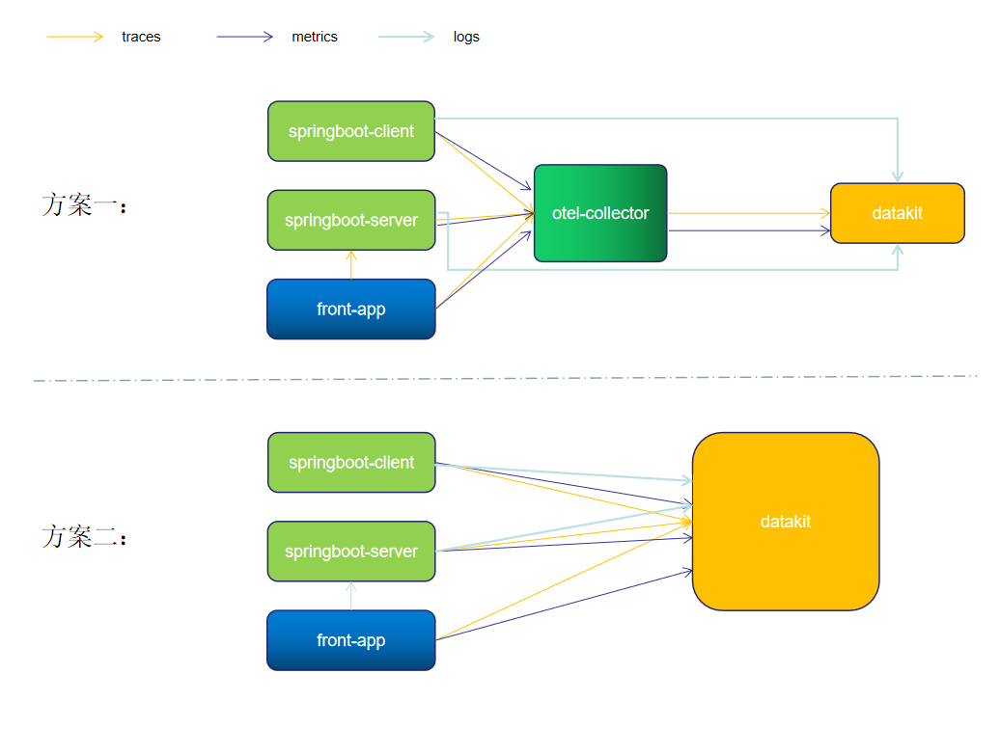

# 当前demo为 Opentelemetry to 观测云

博客地址 https://www.yuque.com/dataflux/bp/ezuo9s

```
image: otel/opentelemetry-collector-contrib:0.51.0
```

## 服务列表

| 服务名称           | 端口        | 描述                       | 请求地址            |
| -------------- | --------- | ------------------------ | --------------- |
| otel-collector |           | 端口查看 docker-compose.yml  |                 |

## 架构



### 架构说明

1、应用 server 和 client 将 metric 、trace 数据通过 otlp-exporter push 到 otel-collector

2、front-app 为前端链路，将链路信息 push 到 otel-collector，并访问应用服务 API

3、otel-collector 对数据进行收集、转换后，将 metric 和 trace 数据通过otlp-exporter 传输到 datakit

4、同时应用 server 和 client 将 logs push 到 datakit。

> datakit 采集日志有多种方式，本次最佳实践主要是通过 socket 方式进行日志收集。springboot 应用主要是通过 Logback-logstash 将日志推送到 datakit。

### Exporter
otel-collector 配置了 1 个 exporter：otlpExporter.

```yaml
  otlp:
    endpoint: "http://192.168.91.11:4319"
    tls:
      insecure: true
    compression: none # 不开启gzip
```
> 参数说明
> endpoint ："http://192.168.91.11:4319" #当前填写的是datakit opentelemetry 采集器地址，协议为 GRPC。
> tls.insecure : true # 关闭tls 安全校验
> compression: none # 不开启gzip，默认开启


> <font color="red">注意，所有的应用都部署在同一个机器上，机器 ip 为 192.168.91.11。如果应用和一些中间件单独分开部署，则注意修改对应的 IP。如果是云服务器，则注意开放相关端口，以免访问失败。</font>


## 观测云平台
基于强大的数据采集能力，“观测云”构建了从基础设施，容器，中间件，数据库，消息队列，应用链路，前端访问，系统安全，网络访问性能全链路的可观测性，基于观测云标准产品，在用户正确的配置了Datakit采集以后，可以很快的实现自己项目的完整可观测性的构建，同时基于行协议（Line Protocol），以及观测云的场景构建能力，用户还可以自定义所需观测的指标方便的整合在一起，实现进一步的可观测性。
“观测云”整体作为一个面向可观测性的完整技术产品，本身存在着非常多的技术门槛，相较于开源的各种方案，观测云从一开始就非常强调整如何有效的降低用户使用产品的学习成本以及提升用户的易用性。因此从DataKit的安装部署，包括所有的可配置能力，“观测云”尽量选择降低用户的配置难度，以符合大部分程序员和运维工程师的习惯，同时提升整个UI的易用度和专业度，让使用者能很快了解产品的用户和其所带来的价值。

## Datakit
Datakit 作为观测云平台基础数据采集工具，主要用于采集系统运行的各种指标、日志等数据，通过 Dataway 将它们汇总给观测云，在观测云中，用户可以查看并分析自己的各种指标、日志等数据。DataKit 是观测云中至关重要的一个数据采集组件，所有观测云中的数据都是来源于 DataKit。
 DataKit 部署配置极为简单明了并且可以通过可视化的客户端帮助用户管理 DataKit。DataKit 不仅仅可以收集日志数据更包含了 APM 数据、基础设施、容器、中间件、网络性能等等。DataKit 不需要像 LogStash 和 Fluentd 一样依赖如 ElasticSearch，Kafka 等组件来做业务功能补足，观测云完全不需要考虑这些问题用户可以真正的做到只关心自己的业务优化。DataKit 不需要使用人员掌握庞杂的技术栈付出高昂的学习成本，仅需要简单配置就可以搭配观测云来解决各种复杂的业务问题了。ELK 和 EFK 整体运维成本巨大，光 ElasticSearch 集群就需要大量的费用，如果同时考虑冷热数据以节约成本也会令人头痛，使用观测云则无需考虑这些问题只要把注意力都集中到业务上就可以了。

## 部署

1. 执行docker-compose up -d

2. 检查应用运行情况 docker-compose ps 

3. [安装datakit](https://www.yuque.com/dataflux/datakit/datakit-install)，datakit 安装之前需要注册一个[观测云](https://guance.com/) 账号

4. 开启 datakit opentelemetry采集器

5. 启动 server （https://github.com/lrwh/observable-demo/blob/main/springboot-server ）、client(可选 https://github.com/lrwh/observable-demo/blob/main/springboot-client )、front-app( https://github.com/lrwh/observable-demo/tree/main/opentelemetry-js )

6. 访问 http://front-app-host:front-app-port/xml-http-request，产生 trace 信息并调用接口。

7. 登录[观测云](https://guance.com/)平台，查看traces、metrics、logs。

## 相关文章

[安装datakit](https://www.yuque.com/dataflux/datakit/datakit-install)

[“观测云” VS ELK、EFK](https://www.yuque.com/dataflux/bp/vkrf60)

[OpenTelemetry 链路数据接入最佳实践](https://www.yuque.com/dataflux/bp/opentelemetry)


