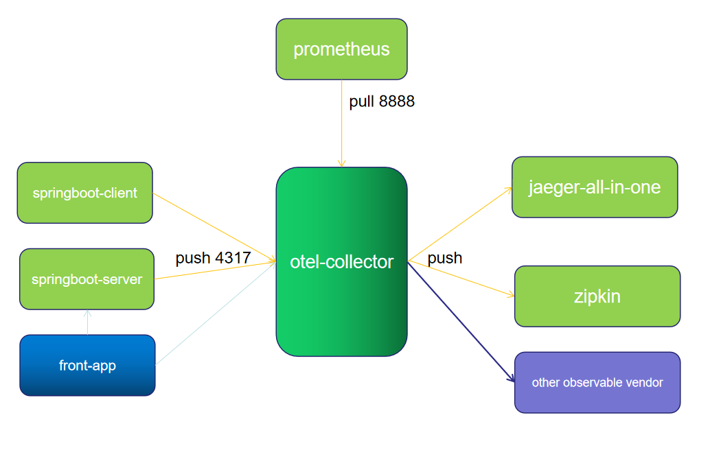
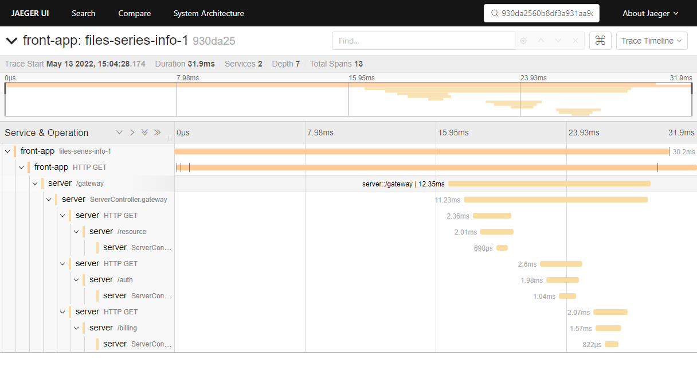
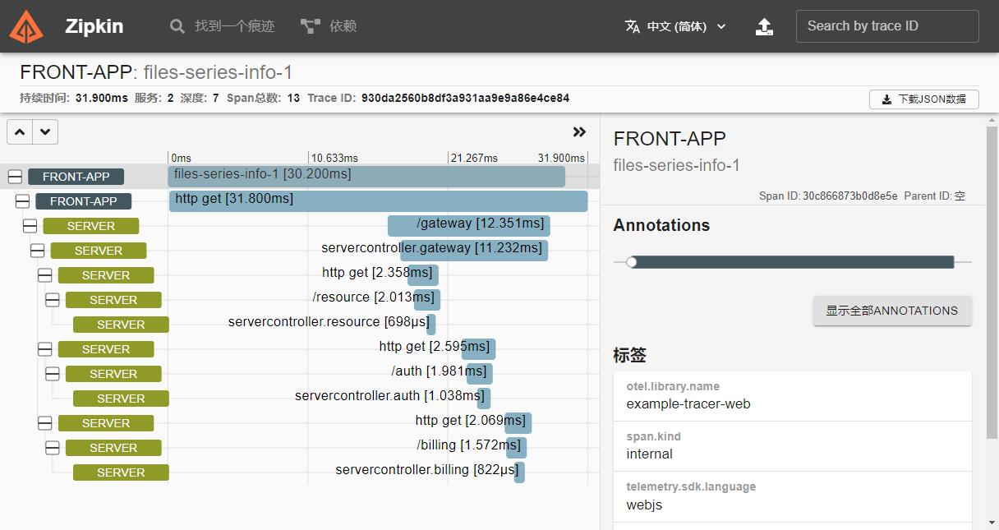
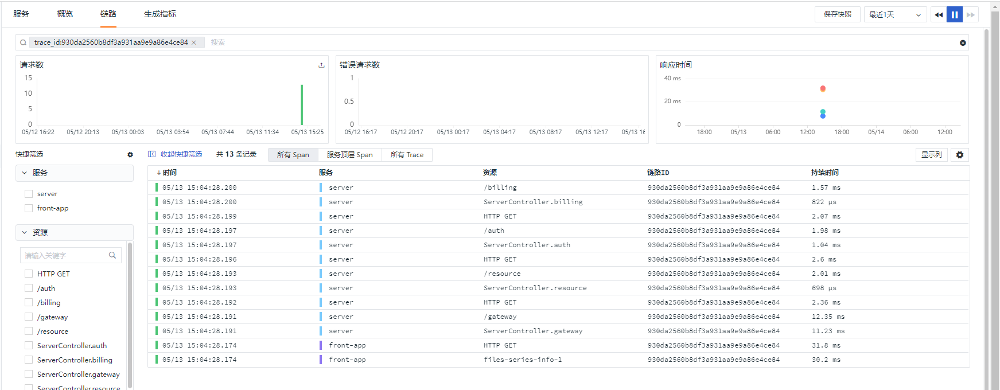
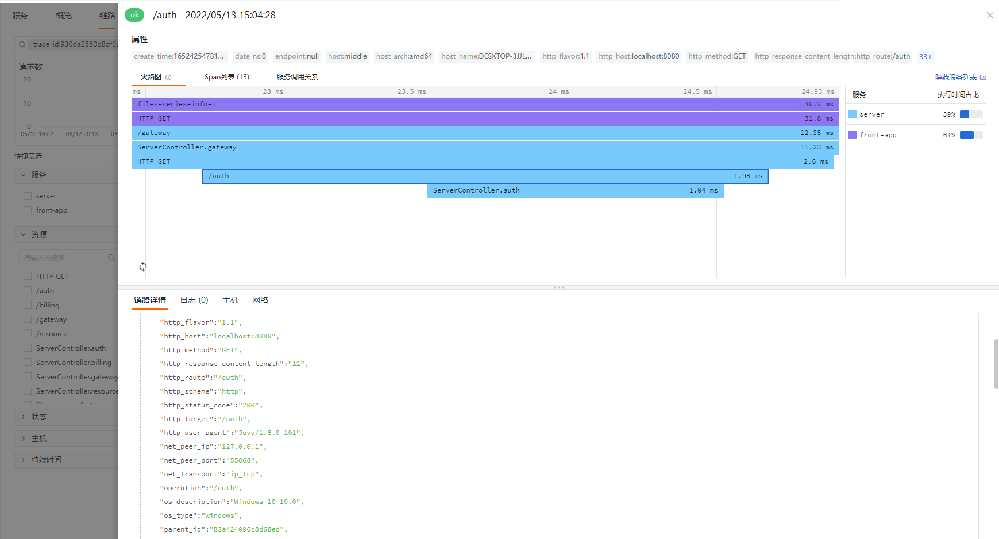

# 当前demo为 otel-collector

opentelemetry-collector 版本为 0.50.0

```
image: otel/opentelemetry-collector:0.50.0
```

## 服务列表

| 服务名称           | 端口        | 描述                       | 请求地址            |
| -------------- | --------- | ------------------------ | --------------- |
| jaeger         |           | 端口查看 docker-compose.yml  | http://ip:16686 |
| zipkin         | 9411:9411 | openzipkin/zipkin:latest | http://ip:9411  |
| otel-collector |           | 端口查看 docker-compose.yml  |                 |
| prometheus     | 9090:9090 | prom/prometheus:latest   | http://ip:9090  |

## 架构



### 架构说明

1、应用server和client将数据通过otlp-exporter push 到 otel-collector

2、front-app 为前端链路，将链路信息push到otel-collector，并访问应用服务API

3、otel-collector做数据处理后，将数据push到jaeger和zipkin以及其他需要接收数据的厂商

4、同时Prometheus从otel-collector pull数据。

otel-collector 配置了四个exporter.

```yaml
  prometheus:
    endpoint: "0.0.0.0:8889"
    const_labels:
      label1: value1
  logging:

  zipkin:
    endpoint: "http://otel_collector_zipkin:9411/api/v2/spans"
    format: proto

  jaeger:
    endpoint: otel_collector_jaeger:14250
    tls:
      insecure: true
  otlp:
    endpoint: "http://192.168.91.11:4319" # 将链路信息输出到其他观测平台
    tls:
      insecure: true
    compression: none # 不开启gzip
```

## 部署

1. 执行docker-compose up -d

2. 检查应用运行情况 docker-compose ps 

3、启动 server （https://github.com/lrwh/observable-demo/blob/main/springboot-server）、client(可选 https://github.com/lrwh/observable-demo/blob/main/springboot-client)、front-app(https://github.com/lrwh/observable-demo/tree/main/opentelemetry-js)

4、访问 http://<front-app-host>:<front-app-port>/xml-http-request，产生trace信息并调用接口。

5、查看各个观测平台UI

如产生traceId：930da2560b8df3a931aa9e9a86e4ce84，在不同UI平台上效果如下：

## jaeger-ui



## zipkin-ui



## [观测云](https://www.guance.com/)




