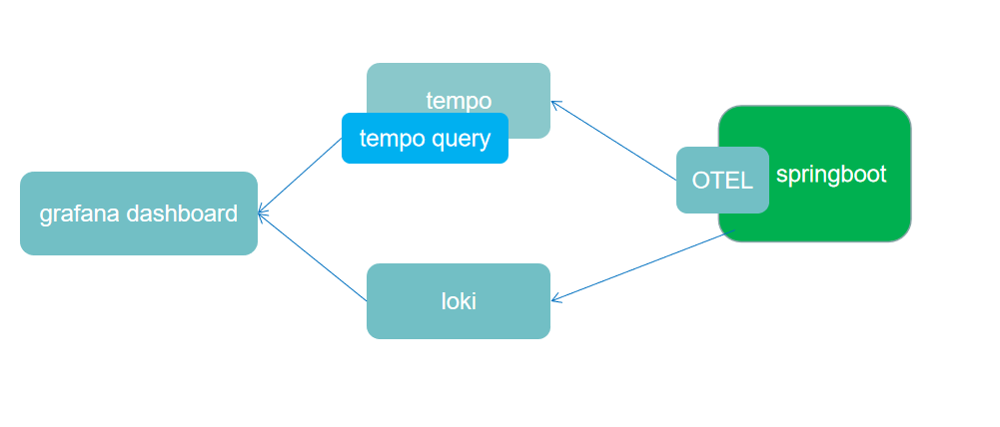

# Opentelemetry to Grafana

## Tempo

Grafana Tempo 是一个开源、易于使用且大规模的分布式跟踪后端。Tempo 具有成本效益，只需要对象存储即可运行，并且与 Grafana、Prometheus 和 Loki 深度集成。Tempo 可与任何开源跟踪协议一起使用，包括 Jaeger、Zipkin 和 OpenTelemetry。

Tempo 项目于 2020 年在 Grafana 实验室启动，并于 10 月在 Grafana ObservabilityCON 上宣布。Tempo 是在 AGPLv3 许可下发布的。

Tempo 的定位跟`opentelemetry-collector`比较类似，目前也比较简单，只是简单的收集trace信息。

## Loki

Loki是 Grafana Labs 团队最新的开源项目，是一个水平可扩展，高可用性，多租户的日志聚合系统。它的设计非常经济高效且易于操作，因为它不会为日志内容编制索引，而是为每个日志流编制一组标签。项目受 Prometheus 启发，官方的介绍就是：Like Prometheus, but for logs.，类似于 Prometheus 的日志系统。

## 服务列表

| 服务名称              | 端口                    | 描述                                                                       | 请求地址                               |
| ----------------- | --------------------- | ------------------------------------------------------------------------ | ---------------------------------- |
| springboot-server | 8080                  | 源码地址 https://github.com/lrwh/observable-demo/tree/main/springboot-server | curl http://localhost:8080/gateway |
| loki              | 3100                  |                                                                          |                                    |
| tempo             | 8081:80 / 55680:55680 |                                                                          |                                    |
| tempo-query       | 16686                 | jaeger-ui                                                                | 浏览器访问 http://localhost:16686       |
| grafana           | 3000                  |                                                                          | 浏览器访问 http://localhost:3000        |

## 架构

### 架构说明

1.  OTEL 采集输出 Springboot 应用的 Trace数据，并为对应的日志打上 tag: Traceid、Spanid 标签。 
2.  Tempo 收集处理 OTEL 数据并本地化存储。Tempo Query 为 Tempo 的检索后端服务。 
3.  Loki 收集 Springboot 应用的日志数据。 
4.  Grafana Dashboard 用于展示和查看Tempo traces 数据和日志数据。 

## 部署

1. 安装 Loki logging driver
   
   `docker plugin install grafana/loki-docker-driver:latest --alias loki --grant-all-permissions`

2. 执行docker-compose up -d

3. 检查应用运行情况 docker-compose ps 

4. 访问url 产生链路和日志信息 http://localhost:8080/gateway

5. 访问grafana查看日志和链路信息

## 拓展

Tempo存储和检索跟踪，是一个后端服务，tempo同时需要与其他链路追踪协议一起使用：Jaeger、Zipkin 、OPTL 。Tempo 并不能算是 Traces 采集器，而是中转站，链路用其他协议，如 Jaeger、Zipkin 等，将数据汇聚至 Tempo。

Tempo作为 Grafana-labs 新的孵化产品并不成熟，在使用 Tempo 过程中如若出现的一些问题，需极大的依赖Grafana 团队社区协助，增加了沟通成本。

Loki的作为新型的日志存储工具，也有着自身的优缺点：

优点

- Loki的架构非常简单，使用了和 Prometheus 一样的标签来作为索引，通过这些标签既可以查询日志的内容也可以查询到监控的数据，不但减少了两种查询之间的切换成本，也极大地降低了日志索引的存储。
- 与ELK相比，消耗的成本更低，具有成本效益。
- 在日志的收集以及可视化上可以连用 Grafana，实现在日志上的筛选以及查看上下行的功能。

缺点：

- 技术比较新颖，相对应的论坛不是非常活跃。
- 功能单一，只针对日志的查看，筛选有好的表现，对于数据的处理以及清洗没有ELK强大，同时与ELK相比，对于后期，ELK 可以连用各种技术进行日志的大数据处理，但是 Loki 不行。
