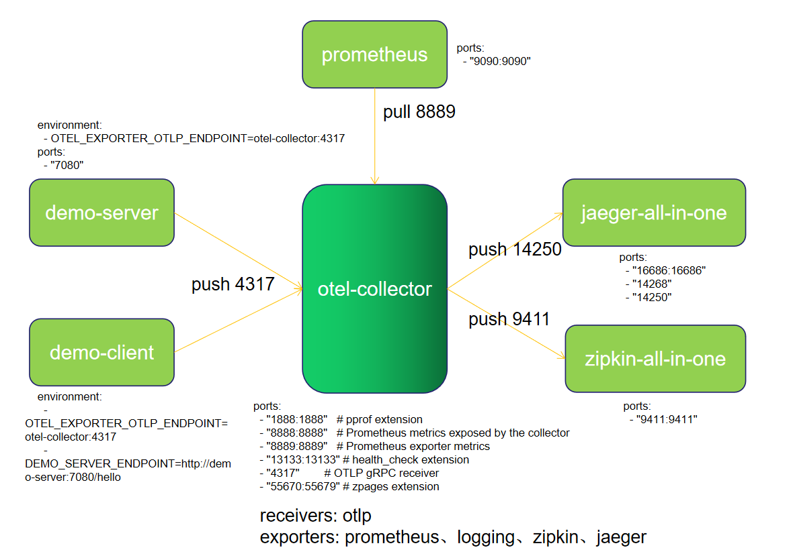
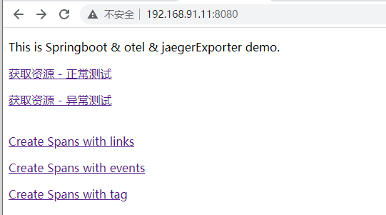
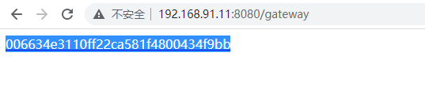
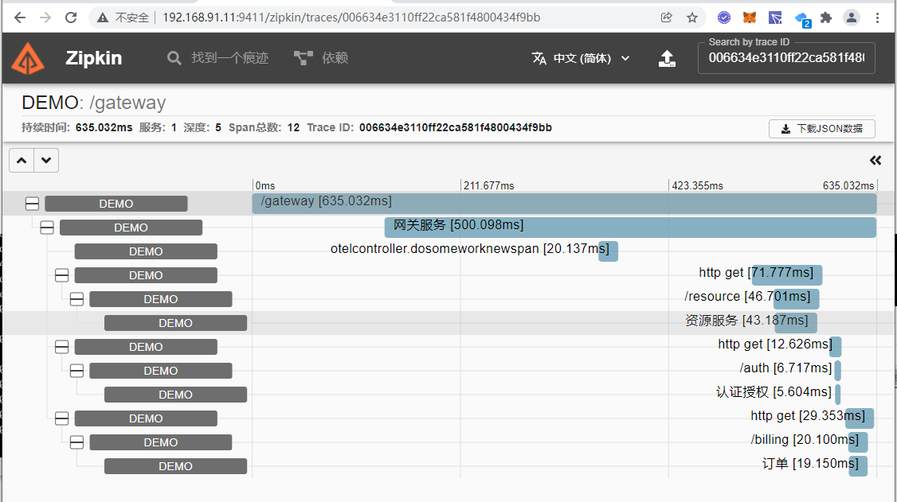
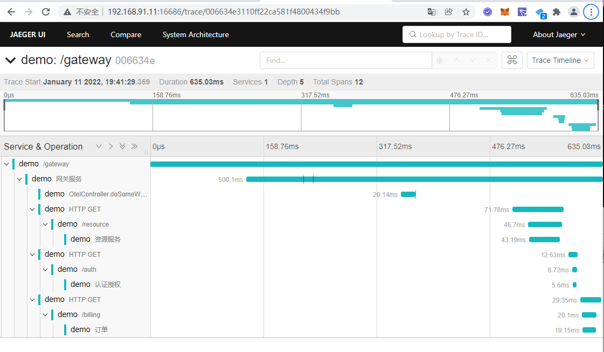

# 本demo为otel-collector-demo

## 服务列表

| 服务名称                                   | 端口        | 描述                       | 请求地址            |
| -------------------------------------- | --------- | ------------------------ | --------------- |
| springboot_opentelemetry_jaeger_server | 8080      | app                      | http://ip:8080  |
| springboot_opentelemetry_jaeger_client | 8081      | app(可以只用server)          | http://ip:8081  |
| jaeger                                 |           | 端口查看 docker-compose.yml  | http://ip:16686 |
| zipkin                                 | 9411:9411 | openzipkin/zipkin:latest | http://ip:9411  |
| otel-collector                         |           | 端口查看 docker-compose.yml  |                 |
| prometheus                             | 9090:9090 | prom/prometheus:latest   | http://ip:9090  |

## 架构



### 架构说明

1、应用server和client将数据通过otlp-exporter push 到 otel-collector

2、otel-collector做数据处理后，将数据push到jaeger和zipkin

3、同时Prometheus从otel-collector pull数据。

otel-collector 配置了三个exporter.

```yaml
exporters:
  prometheus:
    endpoint: "0.0.0.0:8889"
    const_labels:
      label1: value1
  logging:

  zipkin:
    endpoint: "http://otel_collector_zipkin:9411/api/v2/spans"
    format: proto

  jaeger:
    endpoint: otel_collector_jaeger:14250
    tls:
      insecure: true
```

## 部署

1. 在项目根目录执行 mvn clean package -DskipTests=true

2. 复制 springboot_opentelemetry_jaeger_server 的Dockerfile，到当前目录并重命名为：DockerfileServer

3. 复制 springboot_opentelemetry_jaeger_server 的jar到当前目录

4. 复制 springboot_opentelemetry_jaeger_client 的Dockerfile，到当前目录并重命名为：DockerfileClient

5. 复制 springboot_opentelemetry_jaeger_client的jar到当前目录

6. 复制opentelemetry-javaagent的opentelemetry-javaagent.jar到当前目录

7. 执行docker-compose up -d

8. 检查应用运行情况 docker-compose ps 

## 请求server，点击‘获取资源 - 正常测试’，产生一个traceId.





## 将traceId复制到zipkin查找链路信息



## 将traceId复制到jaeger查找链路信息


