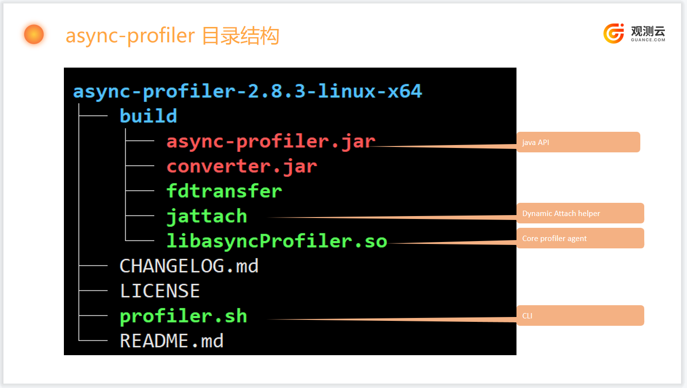
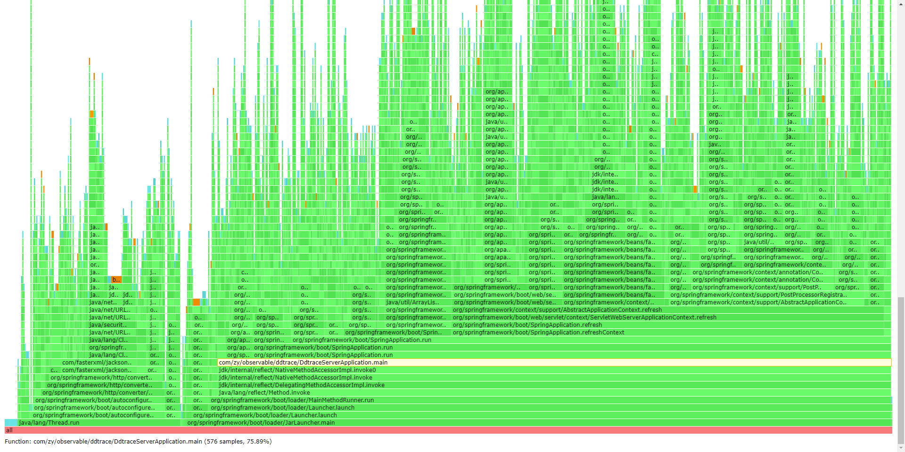
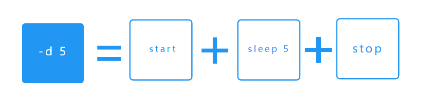
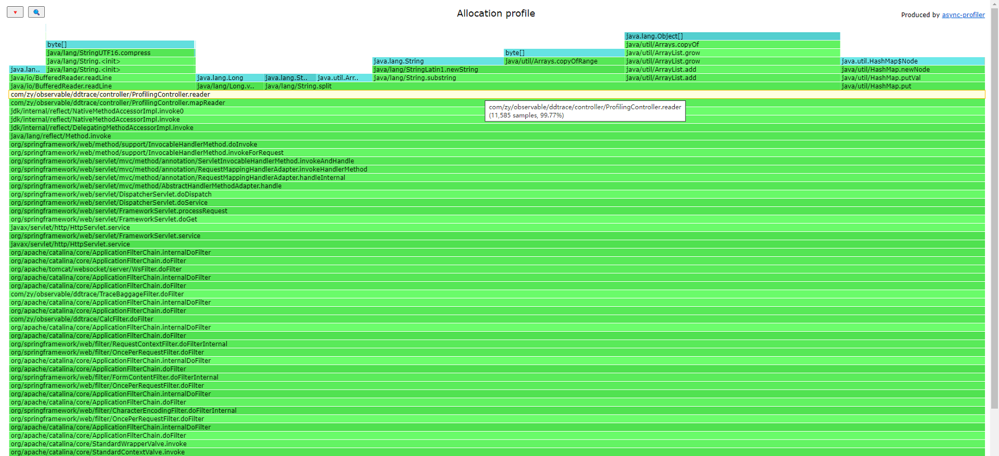
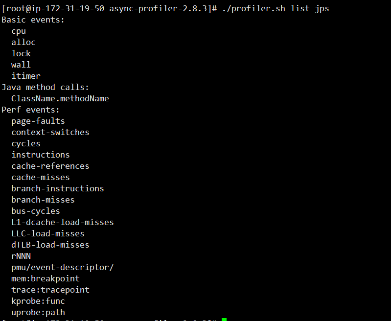

当前 demo 主要用于 async-profiler 性能分析测试。  
___

Java profiling 除了通过 JFR（JAVA Flight Recording）方式获取之外，另外一种方式就是 `async-profiler`。

## async-profiler 介绍
async-profiler 是一款没有 Safepoint bias problem 的低开销 java 采集分析器，它利用 HotSpot 特殊的api 来收集栈信息以及内存分配信息，可以在 OpenJDK,Oracle JDK以及一些其他的基于 HotSpot 的 java虚拟机。

async-profiler 可以收集以下几种事件：

- CPU cycles
- 硬件和软件性能计数器，如cache misses, branch misses, page faults, context switches 等
- Java 堆的分配
- Contented lock attempts, 包括 Java object monitors 和 ReentrantLocks

### CPU 性能分析
在这种模式下，分析器收集堆栈跟踪样本，其中包括**Java**方法、 **本机**调用、**JVM**代码和**内核**函数。

一般的方法是接收 `perf_events` 生成的调用堆栈，并将它们与 `AsyncGetCallTrace` 生成的调用栈进行匹配，以便生成Java和本机代码的准确概要。此外，异步分析器还提供了一种变通方法，可以在 `AsyncGetCallTrace` 失败的某些角落情况下恢复堆栈跟踪。

与将 perf_events 直接用于将地址转换为 Java 方法名的 Java 代理相比，这种方法具有以下优点：

- 适用于较旧的 Java 版本，因为它不需要 `-XX:+PreserveFramePointer`，它仅在 JDK 8u60 及更高版本中可用。
- 不引入`-XX:+PreserveFramePointer `的性能开销，这种开销在极少数情况下可能高达10%。
- 不需要生成映射文件来将 Java 代码地址映射到方法名。
- 适用于解释器框架。
- 不需要写出 `perf.data` 文件以在用户空间脚本中进行进一步处理。

### 内存分配分析

可以将探查器配置为收集分配了最大堆内存量的调用站点，而不是检测消耗 CPU 的代码。

async-profiler 不使用侵入性技术，如字节码检测或昂贵的 `DTrace` 探测器，这些技术会对性能产生重大影响。它也不会影响逃逸分析或阻止 JIT 优化，如分配消除。仅测量实际的堆分配。

该分析器具有`TLAB`驱动的采样功能。它依赖于 `HotSpot` 特定的回调来接收两种通知：

- 当在新创建的 TLAB（火焰图中的水色帧）中分配对象时；
- 当一个对象被分配在 TLAB 之外的慢速路径上时（棕色框架）。

这意味着不计算每个分配，而只计算每_N_ kB 的分配，其中_N_是 TLAB 的平均大小。这使得堆采样非常便宜并且适合生产。另一方面，收集的数据可能不完整，尽管在实践中它通常会反映最高的分配来源。 采样间隔可以通过`--alloc` 选项进行调整。例如，`--alloc 500k `将在平均分配 500 KB 的空间后进行一次采样。但是，小于 TLAB 大小的间隔不会生效。 支持的最低 JDK 版本是出现 TLAB 回调的 7u40。

### Wall-clock profiling

`-e wall` 选项告诉 async-profiler 在每个给定的时间段内对所有线程进行平均采样，而不管线程状态如何：正在运行、正在休眠或已阻塞。例如，这在分析应用程序启动时间时会很有帮助。 挂钟分析器在每线程模式下最有用：-t. 例子：`./profiler.sh -e wall -t -i 5ms -f result.html 8983`

### java 方法性能分析

`-e ClassName.methodName`选项检测给定的 Java 方法，以便使用堆栈跟踪记录此方法的所有调用。

示例：`-e java.util.Properties.getProperty`将分析调用方法的所有位置getProperty。

仅支持非本机 Java 方法。要分析本机方法，请改用硬件断点事件，例如`-e Java_java_lang_Throwable_fillInStackTrace`

**请注意**，如果您在运行时附加 async-profiler，非本机 Java 方法的第一次检测可能会导致 所有已编译方法的去[优化](https://github.com/openjdk/jdk/blob/bf2e9ee9d321ed289466b2410f12ad10504d01a2/src/hotspot/share/prims/jvmtiRedefineClasses.cpp#L4092-L4096)。随后的检测仅刷新_相关代码_。

如果将 async-profiler 作为代理附加，则不会发生大量 CodeCache 刷新。

以下是您可能想要分析的一些有用的本机方法：

- `G1CollectedHeap::humongous_obj_allocate`- 追踪 G1 GC 的 _humongous allocation（巨大内存分配）_；
- `JVM_StartThread`- 跟踪新线程的创建；
- `Java_java_lang_ClassLoader_defineClass1`- 跟踪类加载。

## 目录结构

## 启动方式

> 1.跟随 Java 进程启动，自动载入共享库；  
> 2.程序运行时通过 attach api 动态载入。

### 启动时载入

如果您需要在 JVM 启动后立即分析一些代码，而不是使用`profiler.sh`脚本，可以在命令行加上`async-profiler`作为代理。例如：

> $ java -agentpath:async-profiler-2.8.3/build/libasyncProfiler.so=start,event=alloc,file=profile.html -jar ...

代理库是通过 JVMTI 参数接口配置的。源代码中描述了参数字符串的格式。profler.sh 脚本实际上将命令行参数转换为该格式。

例如，`-e wall`转换为 `event=wall`，`-f profile.html` 转换为 `file=profile.html` 然而，一些参数是由 `profile.sh` 脚本直接处理的。例如：`-d 5` 包含3个操作：使用 `start` 命令附加分析器代理，休眠 5 秒，然后使用 `stop` 命令再次附加代理。

启动时载入只适合应用在启动时候进行分析，而无法在运行时对应用进行实时分析。

### 运行时载入

更多的时候是应用在运行时，需要对应用进行分析。

> ./profiler.sh -e alloc -d 10 -f out.html pid

可以查看到当时的内存使用分配情况，`reader `分配了 99.77% 的内存。

查看当前应用支持的事件

> ./profiler.sh list jps

注意：

    html 格式只支持单事件，jfr 格式支持多种事件输出。

