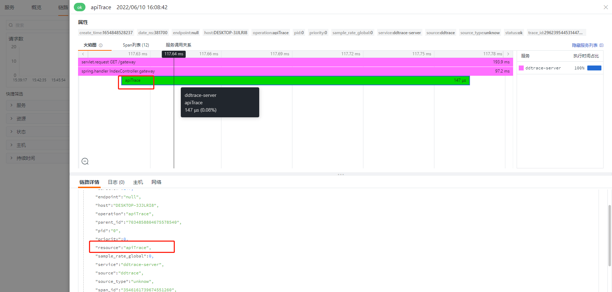
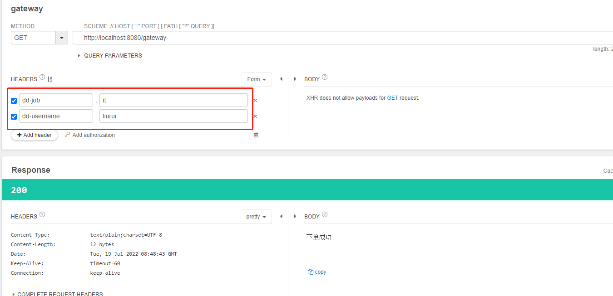
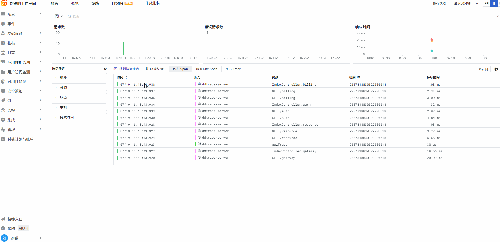

## springboot-ddtrace-server 

主要演示ddtrace 的一些高级用法

当前案例使用 ddtrace 版本 0.114.0（最新版本）进行测试

博客文档：https://docs.guance.com/best-practices/monitoring/ddtrace-skill/

启动

``` shell script
java -javaagent:D:/ddtrace/dd-java-agent-0.97.0.jar \
-Ddd.service=ddtrace-server \
-Ddd.agent.port=9529 \
-jar springboot-ddtrace-server.jar
```
访问
http://localhost:8080


## 入侵式埋点

与前面件Tag有差异，前面是通过 javaagent方式配置埋点，相对来说方便管理和动态埋点，不会因为想要对特殊的请求做一些埋点而调整代码。但同时配置会比较繁琐，入侵式埋点能够很好的跟业务结合，对业务进行埋点，则需要用 dd-trace-api的方式。

以java为例

``` 
    <dependency>
        <groupId>com.datadoghq</groupId>
        <artifactId>dd-trace-api</artifactId>
        <version>0.114.0</version>
    </dependency>
    <dependency>
        <groupId>io.opentracing</groupId>
        <artifactId>opentracing-api</artifactId>
        <version>0.33.0</version>
    </dependency>
    <dependency>
        <groupId>io.opentracing</groupId>
        <artifactId>opentracing-util</artifactId>
        <version>0.33.0</version>
    </dependency>
```

在对应需要埋点的方法添加注解  @Trace

```java
    @Trace
    public String apiTrace(){
        return "apiTrace";
    }
```

然后在 gateway方法调用这个

```java
testService.apiTrace();
```

注意：入侵式埋点不代表应用启动的时候不需要 agent ，如果没有agent， `@Trace` 也将失效。

`@Trace` 注释具有默认操作名称 `trace.annotation`，而跟踪的方法默认具有资源。

可以修改对应的名称
```java
    @Trace(resourceName = "apiTrace",operationName = "apiTrace")
    public String apiTrace(){
        return "apiTrace";
    }
```
修改后，效果如下：


## 让业务关键tag在后端链路进行传递

ddtrace 提供了 Baggage 方式，让指定的tag在链路上进行传递。比如用户名、岗位等信息，方便分析用户行为。

> span.setBaggageItem("username","liurui");

接口请求，携带两个header：dd-username、dd-job



### datakit 配置  
这里需要配合 datakit 的ddtrace采集器配置一起使用  
```toml
customer_tags = ["username", "job"]
```

在观测云上的效果

