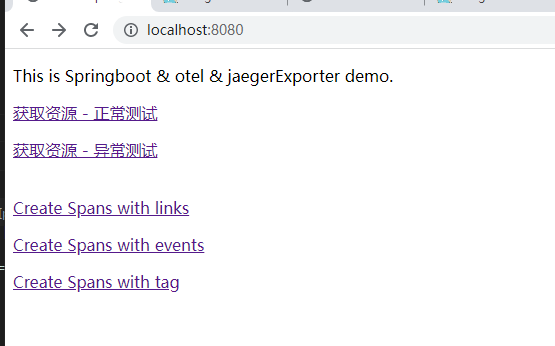
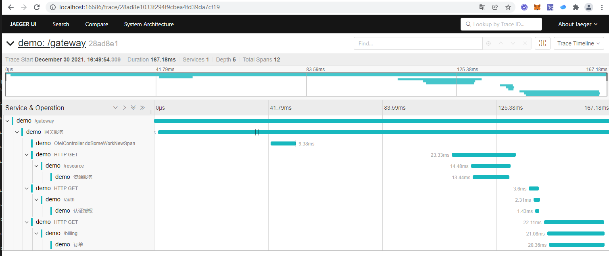

maven pom.xml

```java
<dependencyManagement>
    <dependencies>
        <dependency>
            <groupId>io.opentelemetry</groupId>
            <artifactId>opentelemetry-bom</artifactId>
            <version>1.9.1</version>
<!--            <version>0.17.1</version>-->
            <type>pom</type>
            <scope>import</scope>
        </dependency>
    </dependencies>
</dependencyManagement>
```

```java
 <dependency>
            <groupId>io.opentelemetry</groupId>
            <artifactId>opentelemetry-api</artifactId>
        </dependency>
        <dependency>
            <groupId>io.opentelemetry</groupId>
            <artifactId>opentelemetry-sdk</artifactId>
        </dependency>
<!--        <dependency>-->
<!--            <groupId>io.opentelemetry</groupId>-->
<!--            <artifactId>opentelemetry-exporter-otlp</artifactId>-->
<!--        </dependency>-->
        <dependency>
            <groupId>io.opentelemetry</groupId>
            <artifactId>opentelemetry-extension-annotations</artifactId>
        </dependency>
        <dependency>
            <groupId>io.opentelemetry</groupId>
            <artifactId>opentelemetry-exporter-jaeger</artifactId>
        </dependency>
        <dependency>
            <groupId>io.opentelemetry</groupId>
            <artifactId>opentelemetry-semconv</artifactId>
            <version>1.1.0-alpha</version>
        </dependency>
```

当前服务为springboot-opentelemetry-jaeger-server，可以结合springboot-opentelemetry-jaeger-client一起使用

springboot-opentelemetry-jaeger-server port: 8080

springboot-opentelemetry-jaeger-client port: 8081

#### 启动方式一

```shell
java -javaagent:D:\\opentelemetry-javaagent\\opentelemetry-javaagent.jar \
-Dotel.traces.exporter=jaeger \
-Dotel.exporter.jaeger.endpoint=http://localhost:14250 \
-Dotel.resource.attributes=service.name=demo \
-Dotel.javaagent.debug=false \
-Dotel.metrics.exporter=none -jar springboot-opentelemetry-jaeger-client.jar --trace.exporter.host=localhost --api.url=http://localhost:8080 
```

#### 启动方式二

配置环境变量

```shell
OTEL_TRACES_EXPORTER=jaeger
OTEL_EXPORTER_JAEGER_ENDPOINT=http://localhost:14250
OTEL_EXPORTER_JAEGER_TIMEOUT=10000
```

启动脚本

```shell
nohup java -javaagent:opentelemetry-javaagent.jar \
    -Dotel.metrics.exporter=none \
    -jar springboot-opentelemetry-jaeger-client.jar --trace.exporter.host=localhost --api.url=http://localhost:8080 &
```

或者

```shell
OTEL_TRACES_EXPORTER=jaeger \
OTEL_EXPORTER_JAEGER_ENDPOINT=http://localhost:14250 \
OTEL_EXPORTER_JAEGER_TIMEOUT=10000 \
java -javaagent:opentelemetry-javaagent.jar \
-Dotel.resource.attributes=service.name=demo \
-Dotel.javaagent.debug=false \
-Dotel.metrics.exporter=none \
-jar springboot-opentelemetry-jaeger-client.jar --trace.exporter.host=192.168.91.11 --api.url=http://192.168.91.11:8080
```


trace.exporter.host: exporter的外网地址，如果是本机，就用localhost

api.url: 当前app的访问地址

效果图：




jaeger-ui效果




