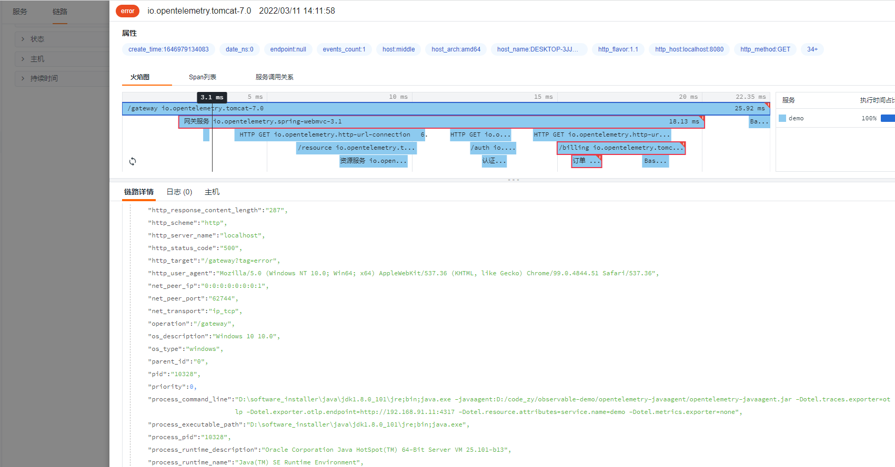
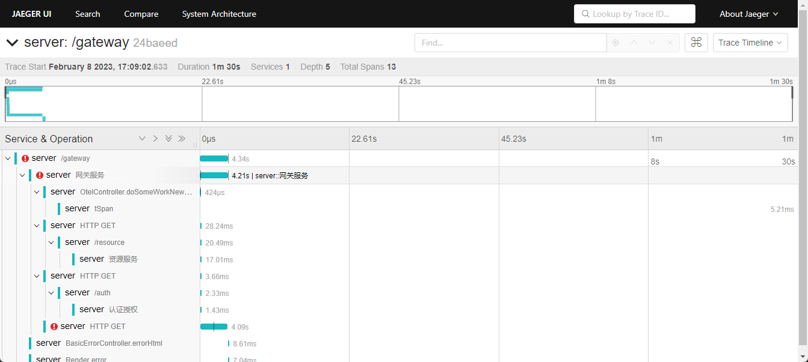
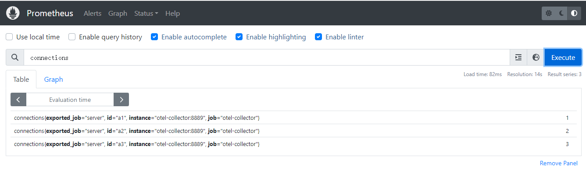

maven pom.xml

```xml
<dependencyManagement>
    <dependencies>
        <dependency>
            <groupId>io.opentelemetry</groupId>
            <artifactId>opentelemetry-bom</artifactId>
            <version>1.21.0</version>
            <type>pom</type>
            <scope>import</scope>
        </dependency>
    </dependencies>
</dependencyManagement>
```

```xml
<dependency>
    <groupId>io.opentelemetry</groupId>
    <artifactId>opentelemetry-exporter-otlp</artifactId>
</dependency>
<dependency>
    <groupId>io.opentelemetry</groupId>
    <artifactId>opentelemetry-extension-annotations</artifactId>
</dependency>
<dependency>
    <groupId>io.opentelemetry</groupId>
    <artifactId>opentelemetry-semconv</artifactId>
    <version>1.21.0-alpha</version>
</dependency>
<dependency>
    <groupId>io.opentelemetry</groupId>
    <artifactId>opentelemetry-sdk-extension-autoconfigure</artifactId>
    <version>1.21.0-alpha</version>
</dependency>
```

### 两种启动方式：

#### 方式一

配置环境变量

```shell
OTEL_TRACES_EXPORTER=otlp \
OTEL_EXPORTER_OTLP_ENDPOINT=http://192.168.91.11:4317 \
OTEL_EXPORTER_OTLP_TIMEOUT=10000 \
java -javaagent:opentelemetry-javaagent.jar \
-Dotel.resource.attributes=service.name=demo \
-Dotel.javaagent.debug=false \
-Dotel.metrics.exporter=none \
-jar springboot-opentelemetry-otlp-server.jar --trace.exporter.host=192.168.91.11 --trace.exporter.port=4317 --client=true
```

#### 方式二：

```shell
java -javaagent:../opentelemetry-javaagent/opentelemetry-javaagent.jar \
-Dotel.traces.exporter=otlp \
-Dotel.exporter.otlp.endpoint=http://192.168.91.11:4317 \
-Dotel.resource.attributes=service.name=demo \
-Dotel.metrics.exporter=none \
-jar springboot-opentelemetry-otlp-server.jar --trace.exporter.host=192.168.91.11 --trace.exporter.port=4317 --client=true
```

trace.exporter.host: exporter数据接收主机，如果是本机，就用localhost
trace.exporter.port: exporter数据接收端口

效果图：


观测云效果



### Baggage 用法

Baggage 可以在整个链路传播，适用于全局埋点，比如用户id埋点、用户名埋点，方便我们对某一个用户追踪。

gateway方法 set Baggage

```java
// Baggage 用法,此处set
        Baggage.current().toBuilder().put("app.username", "gateway").build().makeCurrent();
        logger.info("gateway set baggage[app.username] value: gateway");
```

resource 方法 get Baggage

```java
 // Baggage 用法,此get
        String baggage = Baggage.current().getEntryValue("app.username");
        logger.info("resource get baggage[app.username] value: {}", baggage);
```

### 通过已知的 traceId 和 spanId ,来构造一个新 span。

Tracer 构造 span 提供了`setParent(context)`方法，便于为自定义的 span 构造一个父 span。

```java 
tracer.spanBuilder(spanName).setParent(context)
```
其中 `setParent` 需要传入 `Context` 参数，所以需要构造一个上下文。

而 OpenTelemetry sdk 只提供了一个 `create` 方法用于创建 `SpanContext`，其中可以自定义 traceId 和 spanId。

```java  
SpanContext create(String traceIdHex, String spanIdHex, TraceFlags traceFlags, TraceState traceState)
```

`SpanContext` 作为表示 Span 的一部分，他必须可以进行序列化，并沿着分布式上下文进行传播。`SpanContext` 是不可变的。

OpenTelemetry `SpanContext` 符合 [W3C TraceContext](https://www.w3.org/TR/trace-context/) 规范。这包含两个标识符 - TraceId 和 SpanId - 一套通用 TraceFlags 和 系统特定 TraceState。

1. **`TraceId`** 一个有效的 `TraceId` 是一个 16 字节的数组，且至少有一个非零字节。

2. **`SpanId`** 一个有效的 `SpanId` 是一个 8 字节的数组，且至少有一个非零字节。

3. **`TraceFlags`** 包含该 trace 的详情。不像 `TraceFlags`，`TraceFlags` 影响所有的 traces。当前版本和定义的 Flags 只有 sampled 。

4. **`TraceState`** 携带特定 trace 标识数据，通过一个 KV 对数组进行标识。`TraceState`允许多个跟踪系统参与同一个 Trace。完整定义请参考 [W3C Trace Context specification](https://www.w3.org/TR/trace-context/#tracestate-header) 。

本 API 必须实现创建 SpanContext 的方法。这些方法应当是唯一的方法用于创建 SpanContext。这个功能必须在 API 中完全实现，并且不应当可以被覆盖。

但 SpanContext 并不是 Context，因而还需要做一层转换。

```java
    private Context withSpanContext(SpanContext spanContext, Context context) {
        return context.with(Span.wrap(spanContext));
    }
```
完整代码如下：

```java
    /***
     * @Description 通过已知的traceId和spanId,来构造一个新span。
     * @Param [spanName, traceId, spanId]
     * @return java.lang.String
     **/
    @GetMapping("/customSpanByTraceIdAndSpanId")
    @ResponseBody
    public String customSpanByTraceIdAndSpanId(String spanName,String traceId,String spanId){
        assert StringUtils.isEmpty(spanName):"spanName 不能为空";
        assert StringUtils.isEmpty(traceId):"traceId 不能为空";
        assert StringUtils.isEmpty(spanId):"spanId 不能为空";
        Context context =
                withSpanContext(
                        SpanContext.create(
                                traceId, spanId, TraceFlags.getSampled(), TraceState.getDefault()),
                        Context.current());
        Span span = tracer.spanBuilder(spanName)
                .setParent(context)
                .startSpan();
        span.setAttribute("attribute.a2", "some value");
        span.setAttribute("func","attr");
        span.setAttribute("app","otel3");
        span.end();
        return buildTraceUrl(span.getSpanContext().getTraceId());
    }

    private Context withSpanContext(SpanContext spanContext, Context context) {
        return context.with(Span.wrap(spanContext));
    }
```

**需要特别注意，依据当前测试写法的请求自身会产生一个新的trace信息。新构造的span是依据传入的参数进行构造。**

我们可以通过访问链接来观察结果

http://localhost:8080/customSpanByTraceIdAndSpanId?spanName=tSpan&traceId=24baeeddfbb35fceaf4c18e7cae58fe1&spanId=ff1955b4f0eacc4f




## 指标（Metrics）

OpenTelemetry 还提供了 metric 相关操作的 API。

span 提供关于应用程序的详细信息，但生成的数据与系统上的负载成正比。相比之下，度量将单个度量组合成聚合，并生成作为系统负载函数的常量数据。聚合缺乏诊断低级问题所需的细节，但是通过帮助识别趋势和提供应用程序运行时遥测来补充跨度。

度量API定义了各种工具。仪器记录测量值，这些测量值由度量SDK聚合，并最终导出到进程外。仪器有同步和异步两种。同步仪器记录测量结果。异步仪器注册回调，每次采集调用一次，并记录该时间点的测量值。下列仪器可供选择:

1. **LongCounter/DoubleCounter:** 只记录正数值，有同步和异步选项。用于计算事物，例如通过网络发送的字节数。默认情况下，计数器测量被聚合为始终递增的单调和。

2. **LongUpDownCounter/DoubleUpDownCounter:** 记录正负值，有同步和异步选项。对于计算上升和下降的东西很有用，比如队列的大小。默认情况下，向上向下计数器测量被聚合为非单调和。

3. **LongGauge/DoubleGauge:** 用异步回调测量瞬时值。用于记录不能跨属性合并的值，如 CPU 使用率百分比。默认情况下，量规测量被聚合为量规。

4. **LongHistogram/DoubleHistogram（长直方图/双直方图）:** 记录对直方图分布分析最有用的测量值。没有异步选项可用。用于记录 HTTP 服务器处理请求所花费的时间等。默认情况下，直方图测量被聚合为显式的桶直方图。

### 获取 Meter 对象

API定义了一个 Meter 接口。该接口由一组 instrument 构造器，和一个使用原子方式批量获取测量值的工具组成。Meter 可以通过 `MeterProvider` 的 getMeter(name)方法来创建一个新实例。 `MeterProvider` 通常被期望作为单例来使用。 其实现应作为 `MeterProvider` 全局的唯一实现。通过 Meter 对象可以构建不同类型的 metric。

```java
    @Bean
    public Meter meter() {
        return openTelemetry().getMeter(appName);
    }
```

这里跳过了 `MeterProvider` 的细节，主要原因在于 OpenTelemetry Interface 提供了 `MeterProvider` 的默认 noop 实现。

```java
    default MeterProvider getMeterProvider() {
        return MeterProvider.noop();
    }
```

### 构建 gauge 类型的 metric

```java
    @Bean
    public void customMetrics() {
        meter().gaugeBuilder("connections")
                .setDescription("当前Socket.io连接数")
                .setUnit("1")
                .buildWithCallback(
                        result -> {
                            System.out.println("metrics");
                            for (int i = 1; i < 4; i++) {
                                result.record(
                                        i,
                                        Attributes.of(
                                                AttributeKey.stringKey("id"),
                                                "a" + i));
                            }
                        });
    }
```

`buildWithCallback` 是一个回调方法，会通过定时的方式进行上报，默认1min一次。

效果




## 相关文档

[springboot-opentelemetry-otlp-server](https://github.com/lrwh/observable-demo/tree/main/springboot-opentelemetry-otlp-server)

[opentelemetry api](https://github.com/open-telemetry/docs-cn/blob/main/specification/trace/api.md)

[opentelemetry java](https://opentelemetry.io/docs/instrumentation/java/manual/)

[opentelemetry 参数配置](https://github.com/open-telemetry/opentelemetry-java/blob/main/sdk-extensions/autoconfigure/README.md)