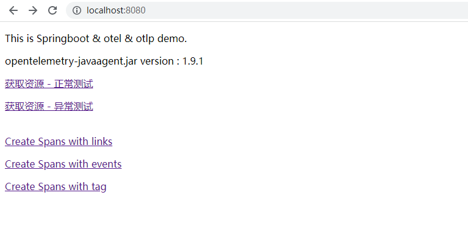

### 两种启动方式：

#### 方式一

配置环境变量

```shell
OTEL_TRACES_EXPORTER=otlp \
OTEL_EXPORTER_OTLP_ENDPOINT=http://192.168.91.11:4317 \
OTEL_EXPORTER_OTLP_TIMEOUT=10000 \
java -javaagent:opentelemetry-javaagent.jar \
-Dotel.resource.attributes=service.name=server \
-Dotel.javaagent.debug=false \
-Dotel.metrics.exporter=none \
-Dotel.propagators=b3 \
-jar springboot-server.jar --client=false
```

#### 方式二：

```shell
java -javaagent:../opentelemetry-javaagent/opentelemetry-javaagent.jar \
-Dotel.traces.exporter=otlp \
-Dotel.exporter.otlp.endpoint=http://192.168.91.11:4317 \
-Dotel.resource.attributes=service.name=server \
-Dotel.metrics.exporter=none \
-Dotel.propagators=b3 \
-jar springboot-server.jar --client=false
```

#### 配置传播器

如果需要与前端链路打通，则需要保证前后端链路采用的是同一种类型的传播器

```java
-Dotel.propagators=b3
```

#### 访问client
开启client
```
curl http://localhost:8080/setClient?c=true
```
关闭client
```
curl http://localhost:8080/setClient?c=false
```
查看当前client状态
``` shell script
curl http://localhost:8080/getClient
```
#### 开启日志

##### 方式一：通过 OTLP 上报日志

应用 server 和 client 将 log 通过 otlp-exporter push 到 otel-collector，再通过 otel-collector exporter 到 Elasticsearch。
修改启动参数

需要在应用启动时添加参数`-Dotel.logs.exporter=otlp`

##### 方式二：通过 Logstash-logback 上报日志

主要是通过 Logstash-logback  提供的 socket 方式将日志上传到 Logstash 上，需要对代码做部分调整。

启动的时候指定logstash相关参数

```shell script
--spring.profiles.active=logstash \
--logstash.host=localhost \
--logstash.port=4560
```
#### server-client

https://github.com/lrwh/observable-demo/blob/main/springboot-client

#### 前端链路

https://github.com/lrwh/observable-demo/blob/main/opentelemetry-js

效果图：




### docker

目前已推送到阿里云docker仓库

其中内置`opentelemetry-javaagent.jar` 版本为`1.13.1`

> docker pull registry.cn-shenzhen.aliyuncs.com/lr_715377484/springboot-server:latest
